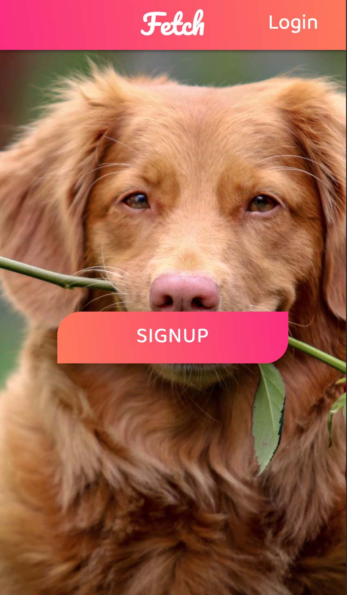
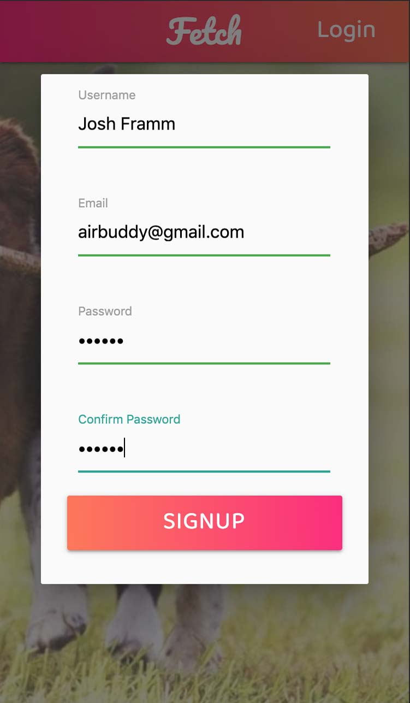
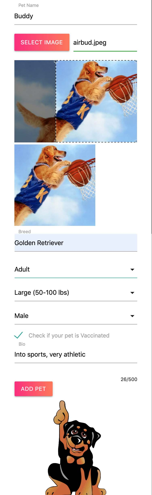
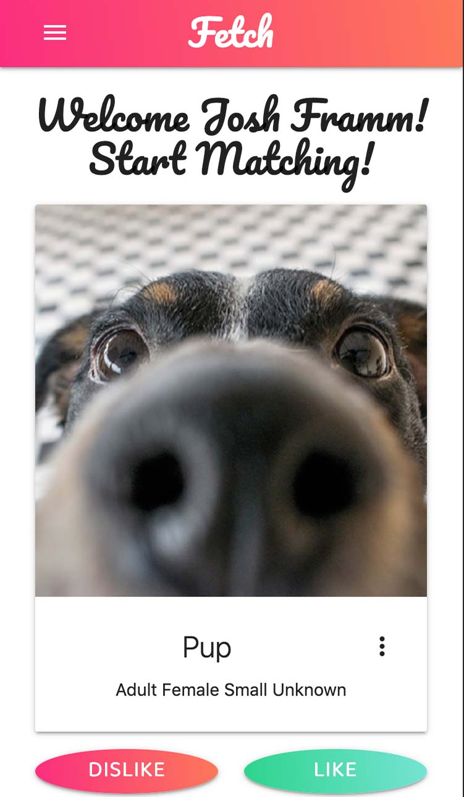
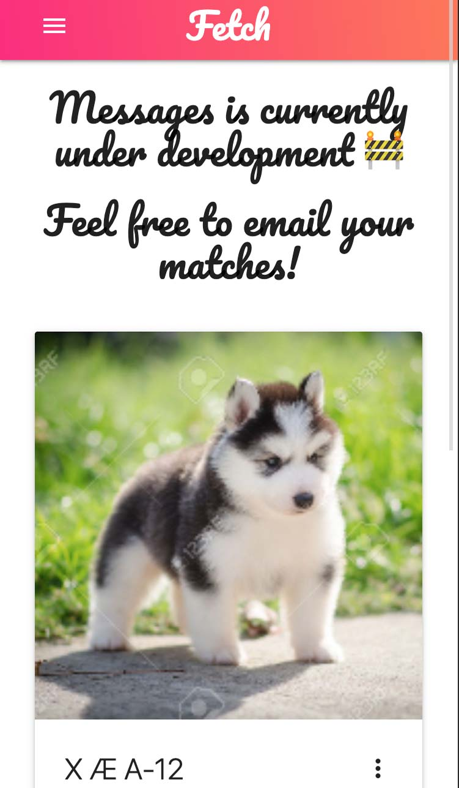

  # Fetch


  ## About
  Fetch connects and helps socialize pets across cities and towns. [Sign up](https://fetch-woof-312.herokuapp.com), add your pet, and start swiping to find a playdate for your furry friend.<br /> Raise Da Woof!<br />
  

  
  ## Table of Contents
  * [Installation](#installation)
  * [Usage](#usage)
  * [Contributing](#contributing)
  * [Tests](#tests)
  * [Development Team](#development-team)
  * [Technology](#technology)
  * [License](#license)
 
  
  ## Installation
  Clone or Fork the [Fetch repo](https://github.com/raise-da-woof/fetch) and navigate to the project's root folder in your terminal, run the following command to install dependencies:
  ```
  npm install
  ```
  Run the following command at the project's root folder:
  ```
  npm start
  ```
  Fetch should now be running locally at http://localhost:3000
  
  
  ## Usage
  1. [Sign up](https://fetch-woof-312.herokuapp.com) with a username, email and password<br />
  <br />
  &nbsp;&nbsp;&nbsp;

  2. Fill out the form to add a pet to your profile, be sure to include an image of your pup!<br />
  <br />
  

  3. Start matching! View photos, bios and other information on potential playdates and hit like to match.<br />
  <br />
  

  4. Setup a playdate, when you and another user like each other they'll be added to your messages list. Messages is currently under construction, but you can view information on your matches and email them to start connecting!<br />
  <br />
  
  
  
  ## Contributing
  There are currently no guidelines for contributing, but we appreciate all feedback, especially [reporting on any issues and bugs](https://github.com/raise-da-woof/fetch/issues).
  
  
  ## Tests
  From the root folder of the project navigate to the *scripts* folder *user.test.js* and *pet.test.js* can be used for testing controller functions on the backend. Uncomment any of the functions and enter necessary data as indicated. write functions will need info on the user or pet and read, update and delete functions will need a valid user Id which can be entered as a string in the *ObjectId* variable.
  Depending on which test file you are using run one of the following commands in the terminal at the project's root folder:
  ```
  npm run user-test
  npm run pet-test
  ```
  Instead of using *res.json()* to return res/err data *console.log* the res/err data and they will show up in the terminal on execution of the script.
  

  ## Development Team
  * [Alex-Bailon](https://github.com/Alex-Bailon)
  * [gmg300](https://github.com/gmg300)
  * [Mohmedvaid](https://github.com/Mohmedvaid)
  * [rwillowlevy](https://github.com/rwillowlevy)
  

  ## Technology
  | Frontend | Backend |
  | ---------| ------- |
  | React | Node | 
  | Redux | Express| 
  | React-image-crop | Mongoose |
  | Axios | Imgur |
  | Materialize | Multer |
  | Animate.css | Passport |
  
  
  ## License
  [](https://opensource.org/licenses/MIT)

  Copyright &copy;2020 Raise Da Woof 
  
  [Back To Top](#fetch)